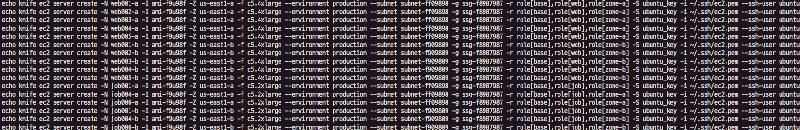
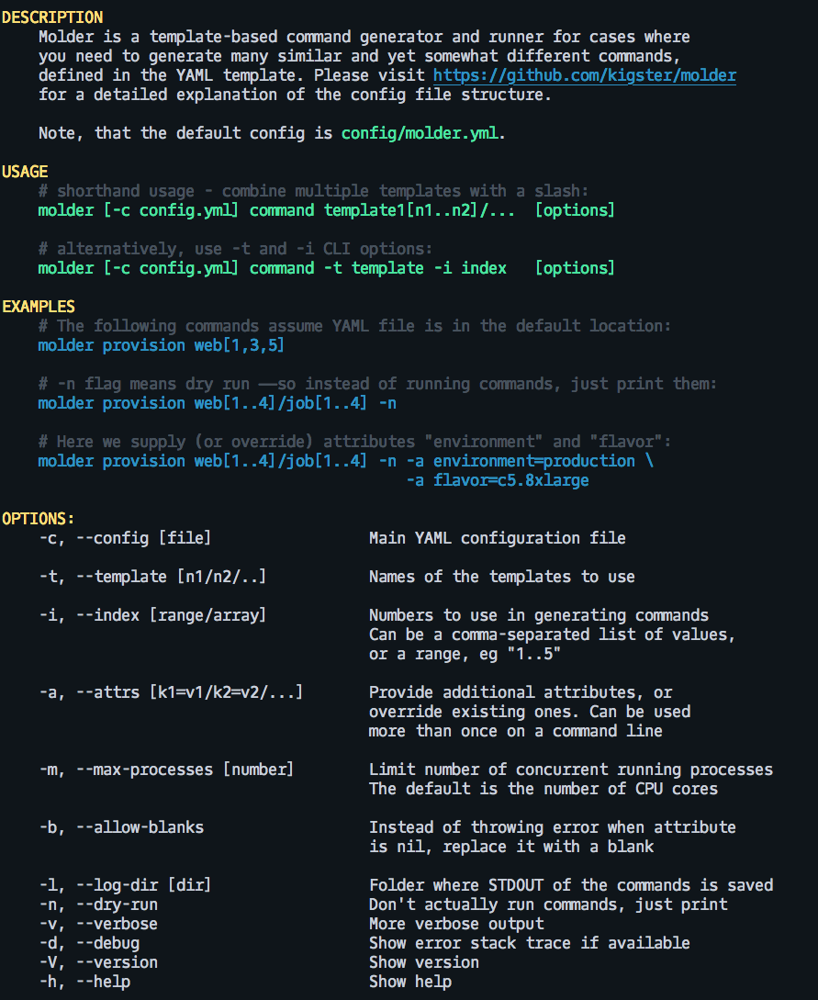

[](https://travis-ci.org/kigster/molder)
[](https://codeclimate.com/github/kigster/molder/maintainability)
[](https://codeclimate.com/github/kigster/molder/test_coverage)
[](https://rubygems.org/gems/molder)

# Molder

Molder is a command line tool for generating and running (in parallel) a set of related but similar commands. A key
use-case is auto-generation of the host provisioning commands for an arbitrary cloud environment. The gem is not constrained to any particular cloud tool or even a command, and can be used to generate a consistent set of commands based on several customizable dimensions.

For example, you could generate 600 provisioning commands for hosts in EC2, numbered from 1 to 100, constrained to the dimensions "zone-id" (values: ["a", "b", "c"]) and the data center "dc" (values: ['us-west2', 'us-east1' ]).

## Usage

Molder works in the following way:

 * It reads the configuration YAML file, described further below
 
 * It parses command line arguments, and extracts the **command name** and **template name(s)**
 
 * It matches the command name with one of the commands specified in the YAML file
 
 * It matches the template name(s) with those in the YAML file
 
 * It then uses [Liquid template language](https://shopify.github.io/liquid/) to substitute tokens in the command template, possibly enumerating over provided numbers.
  
 * Tokens are taken from the template definition, and two more tokens are added: `formatted_number` and `number`. 

### YAML Configuration File

Here is the semi-minimal YAML file that demonstrates all features.

First, at the top, we define the global section. The only arguments there are `log_dir` and `index_format`, the latter is the `sprintf` pattern applied to the numeric index.

```yaml
global:
  log_dir: ./log
  index_format: '%03.3d'
```

Second, we have a `configuration` section that is not really used by the library, but is used within this YAML file to define the templates with the minimum repetition. Note, how we are using `? role[base]` to indicate a hash key with a nil value. These can be merged down below, and `molder` converts all hashes with nil values into an array of keys.

Note how in the name of the instances we are using Liquid markup to reference `formatted_number` and `zone_id`. The former is provided by the gem, and the latter is provided by the template itself.

```yaml
configuration:
  ec2-base: &ec2-base
    image: ami-f9u98f
    flavor: c5.4xlarge
    security_group_id: ssg-f8987987
    ssh_user: ubuntu
    ssh_key: ubuntu_key
    identity_file: '~/.ssh/ec2.pem'
    run_list: &run_list_base
      ? role[base]

  web: &ec2-web
    <<: *ec2-base
    name: web{{ formatted_number }}-{{ zone_id }}
    run_list: &run_list_web
      ? role[web]

  job: &ec2-job
    <<: *ec2-base
    flavor: c5.2xlarge
    name: job{{ formatted_number }}-{{ zone_id }}
    run_list: &run_list_job
      ? role[job]

  us-east1-a: &us-east1-a
    subnet: subnet-ff09898
    zone: us-east1-a
    zone_id: a
    run_list: &run_list_zone_a
      ? role[zone-a]

  us-east1-b: &us-east1-b
    subnet: subnet-f909809
    zone: us-east1-b
    zone_id: b
    run_list: &run_list_zone_b
      ? role[zone-b]
```

Next, we define the actual templates. These are composed of several YAML entries defined above.

Note that we define both zone-specific instances of two types (web and job), as well as an array of web instances (comprised of both zones a and b), and job instances.


```yaml
templates:
  web-a: &web-a
    <<: *us-east1-a
    <<: *ec2-web
    run_list:
      <<: *run_list_base
      <<: *run_list_web
      <<: *run_list_zone_a

  web-b: &web-b
    <<: *ec2-web
    <<: *us-east1-b
    run_list:
      <<: *run_list_base
      <<: *run_list_web
      <<: *run_list_zone_b

  job-a: &job-a
    <<: *ec2-job
    <<: *us-east1-a
    run_list:
      <<: *run_list_base
      <<: *run_list_job
      <<: *run_list_zone_a

  job-b: &job-b
    <<: *ec2-job
    <<: *us-east1-b
    run_list:
      <<: *run_list_base
      <<: *run_list_job
      <<: *run_list_zone_b

  web:
    - <<: *web-a
    - <<: *web-b

  job:
    - <<: *job-a
    - <<: *job-b
```

The final section defines commands that we can generate using this YAML file. We are only including one command here, called `provision`, which comes with a description and args.  Args include extensive set of liquid tokens that are pulled from the template attributes applied to this command.

```yaml
commands:
  provision:
    desc: Provision hosts on AWS EC2 using knife ec2 plugin.
    args: |
      echo knife ec2 server create
        -N {{ name }}
        -I {{ image }}
        -Z {{ zone }}
        -f {{ flavor  }}
        --environment {{ environment }}
        --subnet {{ subnet }}
        -g {{ security_group_id }}
        -r {{ run_list }}
        -S {{ ssh_key }}
        -i {{ identity_file }}
        --ssh-user {{ ssh_user }}; sleep 2
```

So how would we use molder to generate commands that provision a bunch of ec2 hosts for us?

```bash
$ molder provision web[1..5]/job[1,4,6] -a environment=production -c config/molder.yml   
```

This is the output we would see:



Let's understand this command:

 * first argument is `provision` — it has to match one of the commands in the YAML file.
 
 * second argument consists of template names, followed by the numbers in square brackets. Either comma-separated numbers are supported, or a range (not that a range must also be included in square brackets)
 
   * multiple template names can be separated by a slash, as seen here.
   
 * next we pass `-a environment=production` — notice that our provision command defined in the template uses `{{ environment }}` token, even though no such attribute is defined in any of the templates. if we do not supply this argument, the value of environment in the command line would be blank.
 
   * Note that you can pass multiple attributes, separated by a slash, like so: `-a environment=production/flavor=c5.4xlarge`
    
 * The final argument is the template file. The default location is `config/molder.yml` — so if you place the file in that folder you don't need to pass `-c` argument. 
 
### Complete Options List
 
If you run `molder -h` you would see the following:

    

## Installation

Add this line to your application's Gemfile:

```ruby
gem 'molder'
```

And then execute:

    $ bundle

Or install it yourself as:

    $ gem install molder

## Development

After checking out the repo, run `bin/setup` to install dependencies. Then, run `rake spec` to run the tests. You can also run `bin/console` for an interactive prompt that will allow you to experiment.

To install this gem onto your local machine, run `bundle exec rake install`. To release a new version, update the version number in `version.rb`, and then run `bundle exec rake release`, which will create a git tag for the version, push git commits and tags, and push the `.gem` file to [rubygems.org](https://rubygems.org).

## Contributing

Bug reports and pull requests are welcome on GitHub at https://github.com/kigster/molder.

## License

The gem is available as open source under the terms of the [MIT License](https://opensource.org/licenses/MIT).
